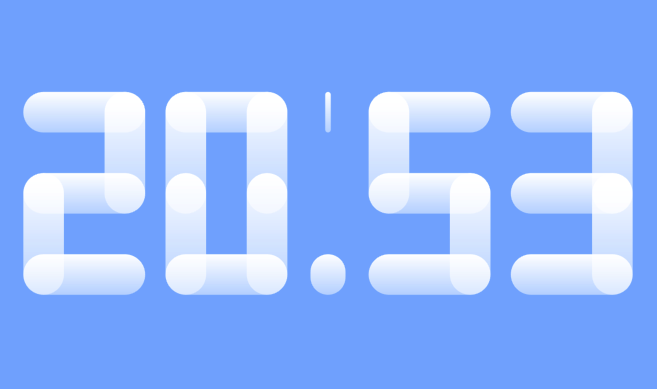
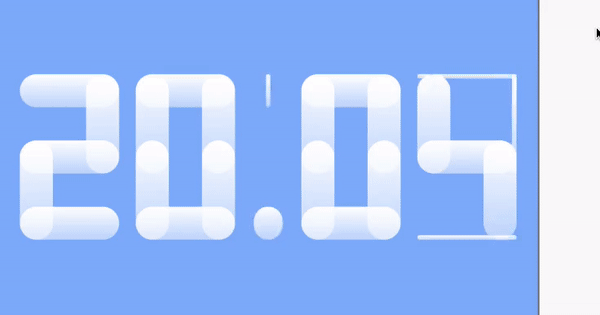

# Flutter Clock Challenge Submission

This is my submission for the Flutter Clock Challenge.
It is based on the digital clock sample project, but my own twist, making each digit 
by animating rounded-edged blocks. Supports 24-hr format, and light and dark theme.
Enjoy!

